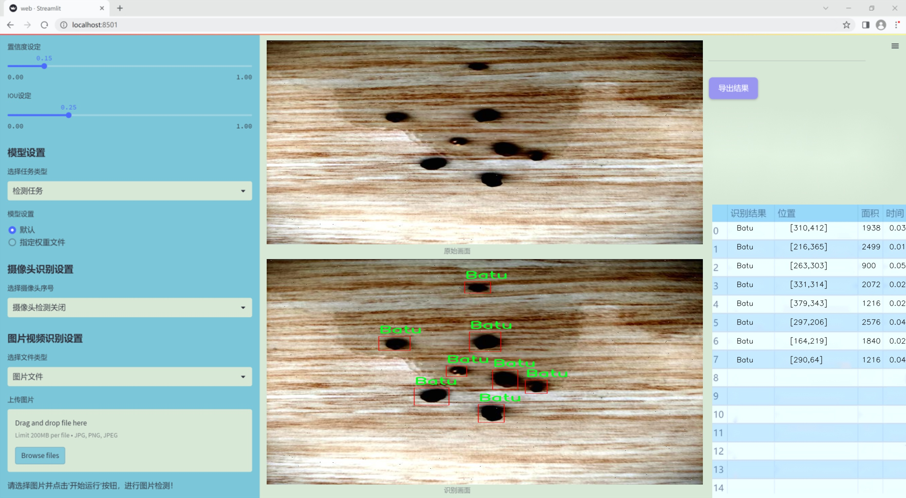
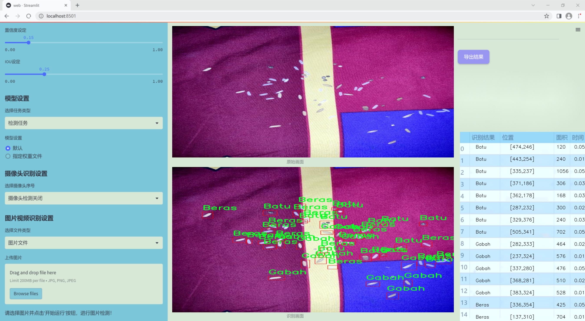
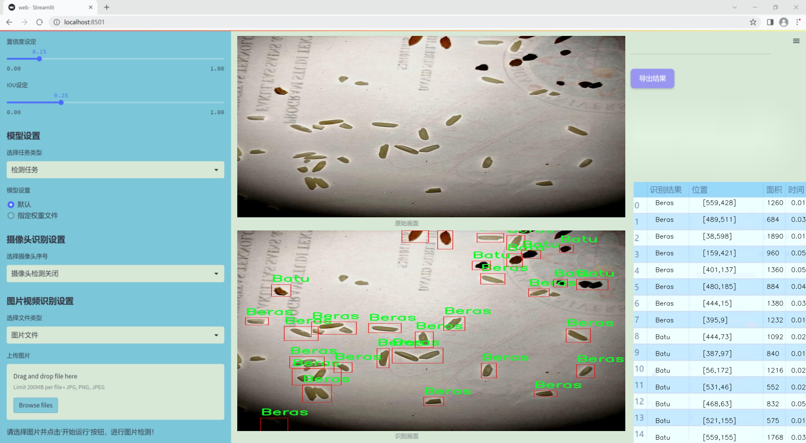
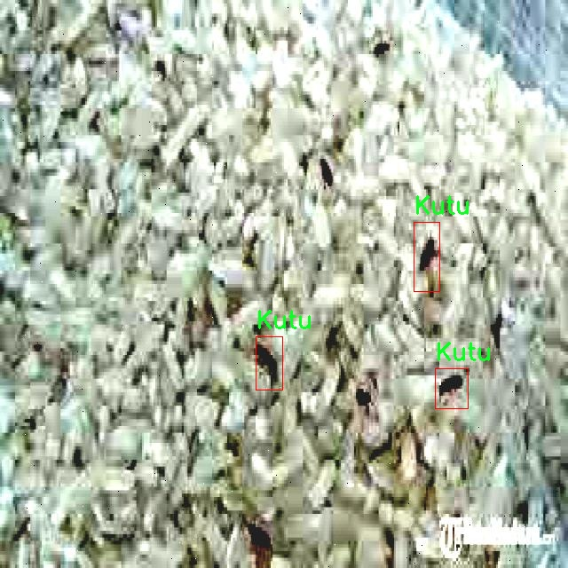
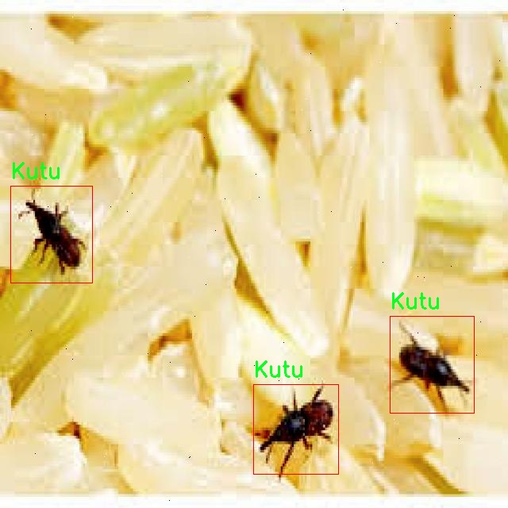
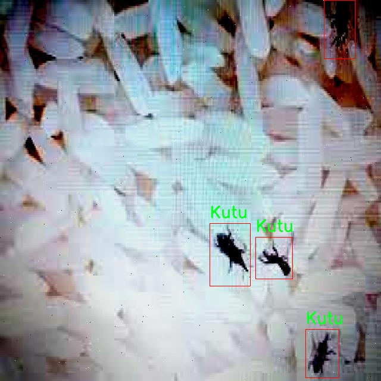
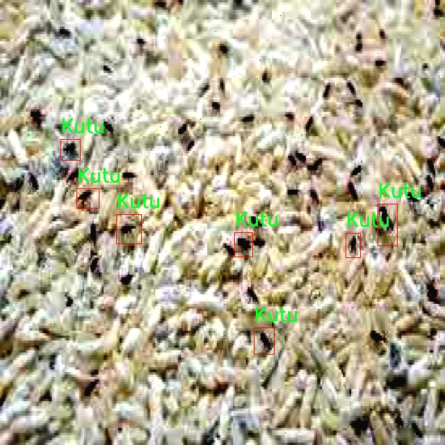

### 1.背景意义

### 研究背景与意义

随着全球农业生产的不断发展，稻米作为主要粮食作物之一，其产量和质量直接影响到人们的生活水平和国家的粮食安全。然而，稻米在生长过程中常常受到多种害虫的侵害，这不仅会导致产量下降，还可能影响稻米的品质。因此，及时、准确地识别和检测稻米害虫种类，对于制定有效的防治措施、提高稻米的产量和质量具有重要的现实意义。

在传统的害虫识别方法中，依赖于人工观察和经验判断，这不仅耗时耗力，而且容易出现误判。随着计算机视觉技术的快速发展，基于深度学习的自动化识别系统逐渐成为解决这一问题的有效手段。YOLO（You Only Look Once）系列模型因其高效的实时检测能力和良好的准确性，已被广泛应用于物体检测领域。针对稻米害虫的识别，改进YOLOv11模型的应用将为实现精准农业提供新的解决方案。

本研究将基于改进的YOLOv11模型，构建一个稻米害虫种类识别检测系统。该系统将利用一个包含734张图像的数据集，涵盖四种主要的稻米害虫类别：Batu、Beras、Gabah和Kutu。通过对数据集的预处理和增强技术的应用，提升模型的泛化能力和识别准确率，进而实现对稻米害虫的快速识别与分类。

本项目的实施不仅能够为稻米种植者提供科学的害虫监测工具，帮助他们及时采取防治措施，还能为农业管理部门提供数据支持，促进农业可持续发展。通过将先进的计算机视觉技术与农业生产相结合，推动智能农业的发展，最终实现提高稻米生产效率和保障粮食安全的目标。

### 2.视频效果

[2.1 视频效果](https://www.bilibili.com/video/BV1EeBeYAERq/)

### 3.图片效果







##### [项目涉及的源码数据来源链接](https://kdocs.cn/l/cszuIiCKVNis)**

注意：本项目提供训练的数据集和训练教程,由于版本持续更新,暂不提供权重文件（best.pt）,请按照6.训练教程进行训练后实现上图演示的效果。

### 4.数据集信息

##### 4.1 本项目数据集类别数＆类别名

nc: 4
names: ['Batu', 'Beras', 'Gabah', 'Kutu']


该项目为【目标检测】数据集，请在【训练教程和Web端加载模型教程（第三步）】这一步的时候按照【目标检测】部分的教程来训练

##### 4.2 本项目数据集信息介绍

本项目数据集信息介绍

本项目所使用的数据集专注于稻米害虫种类的识别与检测，旨在通过改进YOLOv11模型，提高稻米种植过程中的害虫监测效率。数据集的主题为“Pendeteksi Beras”，意在为稻米种植者提供一个高效的工具，以便及时识别和处理稻米害虫，从而减少损失并提高产量。该数据集包含四个主要类别，分别为“Batu”（石头）、“Beras”（稻米）、“Gabah”（稻谷）和“Kutu”（害虫），每个类别的样本数量经过精心挑选，以确保模型训练的有效性和准确性。

在数据收集过程中，我们采用了多种采集手段，包括实地拍摄和网络资源的整合，确保数据的多样性和代表性。每个类别的样本均涵盖了不同的生长阶段和环境条件，力求在训练过程中让模型能够适应各种可能的实际情况。例如，“Kutu”类别中的样本不仅包括不同种类的稻米害虫，还涵盖了它们在不同稻米植株上的分布情况，帮助模型学习到害虫的多样性和潜在的伪装特征。

此外，为了提高数据集的质量，我们对图像进行了标注和预处理，确保每个样本的标签准确无误。数据集的设计不仅考虑到了模型的训练需求，还兼顾了实际应用中的可操作性，使得最终开发的稻米害虫识别系统能够在实际场景中发挥良好的效果。通过对该数据集的深入分析与利用，我们期望能够推动稻米种植领域的智能化发展，为农民提供更为科学和高效的害虫管理方案。










### 5.全套项目环境部署视频教程（零基础手把手教学）

[5.1 所需软件PyCharm和Anaconda安装教程（第一步）](https://www.bilibili.com/video/BV1BoC1YCEKi/?spm_id_from=333.999.0.0&vd_source=bc9aec86d164b67a7004b996143742dc)


[5.2 安装Python虚拟环境创建和依赖库安装视频教程（第二步）](https://www.bilibili.com/video/BV1ZoC1YCEBw?spm_id_from=333.788.videopod.sections&vd_source=bc9aec86d164b67a7004b996143742dc)

### 6.改进YOLOv11训练教程和Web_UI前端加载模型教程（零基础手把手教学）

[6.1 改进YOLOv11训练教程和Web_UI前端加载模型教程（第三步）](https://www.bilibili.com/video/BV1BoC1YCEhR?spm_id_from=333.788.videopod.sections&vd_source=bc9aec86d164b67a7004b996143742dc)


按照上面的训练视频教程链接加载项目提供的数据集，运行train.py即可开始训练



     Epoch   gpu_mem       box       obj       cls    labels  img_size
     1/200     20.8G   0.01576   0.01955  0.007536        22      1280: 100%|██████████| 849/849 [14:42<00:00,  1.04s/it]
               Class     Images     Labels          P          R     mAP@.5 mAP@.5:.95: 100%|██████████| 213/213 [01:14<00:00,  2.87it/s]
                 all       3395      17314      0.994      0.957      0.0957      0.0843

     Epoch   gpu_mem       box       obj       cls    labels  img_size
     2/200     20.8G   0.01578   0.01923  0.007006        22      1280: 100%|██████████| 849/849 [14:44<00:00,  1.04s/it]
               Class     Images     Labels          P          R     mAP@.5 mAP@.5:.95: 100%|██████████| 213/213 [01:12<00:00,  2.95it/s]
                 all       3395      17314      0.996      0.956      0.0957      0.0845

     Epoch   gpu_mem       box       obj       cls    labels  img_size
     3/200     20.8G   0.01561    0.0191  0.006895        27      1280: 100%|██████████| 849/849 [10:56<00:00,  1.29it/s]
               Class     Images     Labels          P          R     mAP@.5 mAP@.5:.95: 100%|███████   | 187/213 [00:52<00:00,  4.04it/s]
                 all       3395      17314      0.996      0.957      0.0957      0.0845


###### [项目数据集下载链接](https://kdocs.cn/l/cszuIiCKVNis)

### 7.原始YOLOv11算法讲解


其实到了YOLOV11 基本创新点就不太多了，主要就是大家互相排列组合复用不同的网络模块、损失函数和样本匹配策略，需要注意YOLO V5、V8 V11
都是1个公司的，其余的个人建议看看V8的，剩下的了解就好。

V11支持多种视觉任务：物体检测、实例分割、图像分类、姿态估计和定向物体检测（OBB）。

##### YOLOv11
基本和YOLOV8同源，甚至git目前都是1个，部分代码注释还是YOLOV8的，所以建议先看我写的YOLOV8相关博客，对比YOLOV8主要涉及到：

*backbone 中的使用C2f模块 变为 c3k2 模块。

*backbone 中的最后一层（sppf层）后增加了C2PSA模块。

*head 解耦头中的分类检测头两个Conv 变为 DWConv。

整体技术而言：

*backbone 使用了C2K2模块+最后SPPF模块级联C2PSA模块；

*neck 使用PAN结构，并且里面也使用C3K2模块；

*head使用了anchor-free + Decoupled-head，其中回归头使用正常的卷积，分类头使用DWConv；

*损失函数使用了分类BCE、回归CIOU + VFL的组合；

*框匹配策略由静态匹配改为了Task-Aligned Assigner匹配方式；

*训练策略没有提及，其中YOLOV8可以参考如下最后 10 个 epoch 关闭 Mosaic 的操作、训练总 epoch 数从 300 提升到了 500。

##### 主要思路


配置文件：[ultralytics/ultralytics/cfg/models/11/yolo11.yaml at main ·
ultralytics/ultralytics ·
GitHub](https://github.com/ultralytics/ultralytics/blob/main/ultralytics/cfg/models/11/yolo11.yaml
"ultralytics/ultralytics/cfg/models/11/yolo11.yaml at main ·
ultralytics/ultralytics · GitHub")

解析函数：[ultralytics/ultralytics/nn/tasks.py at main · ultralytics/ultralytics ·
GitHub](https://github.com/ultralytics/ultralytics/blob/main/ultralytics/nn/tasks.py#L934
"ultralytics/ultralytics/nn/tasks.py at main · ultralytics/ultralytics ·
GitHub")


##### 具体细节

##### input

输入要求以及预处理，可选项比较多，可以参考这个配置文件：[ultralytics/ultralytics/cfg/default.yaml at main
· ultralytics/ultralytics ·
GitHub](https://github.com/ultralytics/ultralytics/blob/main/ultralytics/cfg/default.yaml
"ultralytics/ultralytics/cfg/default.yaml at main · ultralytics/ultralytics ·
GitHub") 的Hyperparameters 部分。

基础输入仍然为640*640。预处理就是熟悉的letterbox（根据参数配置可以为不同的缩放填充模式，主要用于resize到640）+
转换rgb、chw、int8(0-255)->float（0-1），注意没有归一化操作。需要注意的是作者实现的mosaic和网上看到的不同，对比如下图（左边网上版本，右边是YOLO的实现）。并且作者添加了在最后10轮关闭mosaic增强（YOLOV8开始支持，具体原因个人的经验如我的这篇文章：yolov5
mosaic相关，关闭参数在 Train settings 部分的close_mosaic 选项）


##### backbone

主干网络以及改进

这里不去特意强调对比YOLOv5、V8等等的改进，因为各个系列都在疯狂演进，个人认为没必要花费时间看差异，着重看看一些比较重要的模块即可。源代码：

大多数模块：[ultralytics/ultralytics/nn/modules/block.py at main ·
ultralytics/ultralytics ·
GitHub](https://github.com/ultralytics/ultralytics/blob/main/ultralytics/nn/modules/block.py
"ultralytics/ultralytics/nn/modules/block.py at main · ultralytics/ultralytics
· GitHub")

head 部分：[ultralytics/ultralytics/nn/modules/head.py at main ·
ultralytics/ultralytics ·
GitHub](https://github.com/ultralytics/ultralytics/blob/main/ultralytics/nn/modules/head.py
"ultralytics/ultralytics/nn/modules/head.py at main · ultralytics/ultralytics
· GitHub")

串联模块构造网络：[ultralytics/ultralytics/nn/tasks.py at main ·
ultralytics/ultralytics ·
GitHub](https://github.com/ultralytics/ultralytics/blob/main/ultralytics/nn/tasks.py
"ultralytics/ultralytics/nn/tasks.py at main · ultralytics/ultralytics ·
GitHub")

##### 1）CBS 模块（后面叫做Conv）

就是pytorch 自带的conv + BN +SiLU，这里对应上面的配置文件的Conv 的 args 比如[64, 3, 2] 就是 conv2d
的c2=64、k=3、 s =2、c1 自动为上一层参数、p 为自动计算，真实需要计算scales 里面的with 和 max_channels 缩放系数。

这里连续使用两个3*3卷积stride为2的CBS模块直接横竖各降低了4倍分辨率（整体变为原来1/16）。这个还是比较猛的，敢在如此小的感受野下连续两次仅仅用一层卷积就下采样,当然作为代价它的特征图还是比较厚的分别为16、32。


    
    
        class Conv(nn.Module):
        """Standard convolution with args(ch_in, ch_out, kernel, stride, padding, groups, dilation, activation)."""
    
        default_act = nn.SiLU()  # default activation
    
        def __init__(self, c1, c2, k=1, s=1, p=None, g=1, d=1, act=True):
            """Initialize Conv layer with given arguments including activation."""
            super().__init__()
            self.conv = nn.Conv2d(c1, c2, k, s, autopad(k, p, d), groups=g, dilation=d, bias=False)
            self.bn = nn.BatchNorm2d(c2)
            self.act = self.default_act if act is True else act if isinstance(act, nn.Module) else nn.Identity()
    
        def forward(self, x):
            """Apply convolution, batch normalization and activation to input tensor."""
            return self.act(self.bn(self.conv(x)))
    
        def forward_fuse(self, x):
            """Perform transposed convolution of 2D data."""
            return self.act(self.conv(x))

##### 2）c3k2 模块

##### Bottleneck

有两种结构，需要参数shortcut和两个conv的宽度是否相同来控制。

##### C3 & C3K

都是CSP bottleneck module with 3 convolutions, C3 代表3个卷积层，
K代表其中bottleneck中的卷积核为支持自定义，其实这里c3k作者使用的默认的3*3卷积核也就等同于使用c3(c3是3*3卷积核)。

##### c2f & c3k2

其实也就是仿照YOLOv7 的ELAN
结构，通过更多的分支夸层链接，丰富了模型的梯度流。C3K2模块其实就是C2F模块转变出来的，它代码中有一个设置，就是当c3k这个参数为FALSE的时候，C3K2模块就是C2F模块，也就是说它的Bottleneck是普通的Bottleneck；反之当它为true的时候，将Bottleneck模块替换成C3K模块。模块中存在
Split 等操作对特定硬件部署没有之前那么友好了。需要针对自己的硬件进行测试看对最终推理速度的影响。

可视化关系如下，这里需要注意配置文件中的参数，比如21行[-1, 2, C3k2, [512, False, 0.25]]
512代表宽度、false代表是否使用shortcut、0.25代表c2f的宽度缩放。也就是第一个Conv的输出宽度。


源代码如下:

    
    
    class Bottleneck(nn.Module):
        """Standard bottleneck."""
    
        def __init__(self, c1, c2, shortcut=True, g=1, k=(3, 3), e=0.5):
            """Initializes a standard bottleneck module with optional shortcut connection and configurable parameters."""
            super().__init__()
            c_ = int(c2 * e)  # hidden channels
            self.cv1 = Conv(c1, c_, k[0], 1)
            self.cv2 = Conv(c_, c2, k[1], 1, g=g)
            self.add = shortcut and c1 == c2
    
        def forward(self, x):
            """Applies the YOLO FPN to input data."""
            return x + self.cv2(self.cv1(x)) if self.add else self.cv2(self.cv1(x))
    
    class C3(nn.Module):
        """CSP Bottleneck with 3 convolutions."""
    
        def __init__(self, c1, c2, n=1, shortcut=True, g=1, e=0.5):
            """Initialize the CSP Bottleneck with given channels, number, shortcut, groups, and expansion values."""
            super().__init__()
            c_ = int(c2 * e)  # hidden channels
            self.cv1 = Conv(c1, c_, 1, 1)
            self.cv2 = Conv(c1, c_, 1, 1)
            self.cv3 = Conv(2 * c_, c2, 1)  # optional act=FReLU(c2)
            self.m = nn.Sequential(*(Bottleneck(c_, c_, shortcut, g, k=((1, 1), (3, 3)), e=1.0) for _ in range(n)))
    
        def forward(self, x):
            """Forward pass through the CSP bottleneck with 2 convolutions."""
            return self.cv3(torch.cat((self.m(self.cv1(x)), self.cv2(x)), 1))
    
    class C3k(C3):
        """C3k is a CSP bottleneck module with customizable kernel sizes for feature extraction in neural networks."""
    
        def __init__(self, c1, c2, n=1, shortcut=True, g=1, e=0.5, k=3):
            """Initializes the C3k module with specified channels, number of layers, and configurations."""
            super().__init__(c1, c2, n, shortcut, g, e)
            c_ = int(c2 * e)  # hidden channels
            # self.m = nn.Sequential(*(RepBottleneck(c_, c_, shortcut, g, k=(k, k), e=1.0) for _ in range(n)))
            self.m = nn.Sequential(*(Bottleneck(c_, c_, shortcut, g, k=(k, k), e=1.0) for _ in range(n)))
    
    class C2f(nn.Module):
        """Faster Implementation of CSP Bottleneck with 2 convolutions."""
    
        def __init__(self, c1, c2, n=1, shortcut=False, g=1, e=0.5):
            """Initializes a CSP bottleneck with 2 convolutions and n Bottleneck blocks for faster processing."""
            super().__init__()
            self.c = int(c2 * e)  # hidden channels
            self.cv1 = Conv(c1, 2 * self.c, 1, 1)
            self.cv2 = Conv((2 + n) * self.c, c2, 1)  # optional act=FReLU(c2)
            self.m = nn.ModuleList(Bottleneck(self.c, self.c, shortcut, g, k=((3, 3), (3, 3)), e=1.0) for _ in range(n))
    
        def forward(self, x):
            """Forward pass through C2f layer."""
            y = list(self.cv1(x).chunk(2, 1))
            y.extend(m(y[-1]) for m in self.m)
            return self.cv2(torch.cat(y, 1))
    
        def forward_split(self, x):
            """Forward pass using split() instead of chunk()."""
            y = list(self.cv1(x).split((self.c, self.c), 1))
            y.extend(m(y[-1]) for m in self.m)
            return self.cv2(torch.cat(y, 1))
    
    class C3k2(C2f):
        """Faster Implementation of CSP Bottleneck with 2 convolutions."""
    
        def __init__(self, c1, c2, n=1, c3k=False, e=0.5, g=1, shortcut=True):
            """Initializes the C3k2 module, a faster CSP Bottleneck with 2 convolutions and optional C3k blocks."""
            super().__init__(c1, c2, n, shortcut, g, e)
            self.m = nn.ModuleList(
                C3k(self.c, self.c, 2, shortcut, g) if c3k else Bottleneck(self.c, self.c, shortcut, g) for _ in range(n)
            )

##### 3）sppf 模块

对比spp，将简单的并行max pooling 改为串行+并行的方式。对比如下（左边是SPP，右边是SPPF）：


    
    
        class SPPF(nn.Module):
        # Spatial Pyramid Pooling - Fast (SPPF) layer for YOLOv5 by Glenn Jocher
        def __init__(self, c1, c2, k=5):  # equivalent to SPP(k=(5, 9, 13))
            super().__init__()
            c_ = c1 // 2  # hidden channels
            self.cv1 = Conv(c1, c_, 1, 1)
            self.cv2 = Conv(c_ * 4, c2, 1, 1)
            self.m = nn.MaxPool2d(kernel_size=k, stride=1, padding=k // 2)
    
        def forward(self, x):
            x = self.cv1(x)
            with warnings.catch_warnings():
                warnings.simplefilter('ignore')  # suppress torch 1.9.0 max_pool2d() warning
                y1 = self.m(x)
                y2 = self.m(y1)
                return self.cv2(torch.cat((x, y1, y2, self.m(y2)), 1))

##### 4）C2PSA 模块

C2PSA它结合了PSA(Pointwise Spatial
Attention)块，用于增强特征提取和注意力机制。下面的图建议从左到右看，这样才能更有条理的理解，其实PSA个人感觉就是仿着VIT
的Attention来做的，是把输入C2PSA的特征图的h*w 看做VIT 的path数（也可以理解为NLP中token 个数），特征图的channel
数看做VIT特征维度（CNN的宽度，或者理解为NLP中token
编码后的特征维度），然后计算出QKV（这里需要注意第四幅图的QKV是值，不是操作，所以标注成了圆角矩形，这里是为了大家好理解），这里的Attention其实是在h*w维度计算空间Attention，个人感觉是强制给了全局感受野，并且并联了一个3*3的深度可分离卷积的单空间部分，就是仅在每一个特征图上进行3*3卷积，具体实现是通过pytorch
conv2d 的
group参数设置为特征图的通道数。特别的关于Conv的参数分别为：输入通道数、输出通道数、卷积核尺寸、pad尺寸、group数、是否有激活函数（默认silu）。图中的最后一幅省略了一些细节，可以参考源码。

注意区别C2fPSA，C2fPSA才是对 C2f 模块的扩展，通过在标准 C2f 模块中引入 PSA
块，C2fPSA实现了更强大的注意力机制，从而提高了模型对重要特征的捕捉能力。作者实现了该模块但最终没有使用。


涉及的源码：

    
    
    class Attention(nn.Module):
        """
        Attention module that performs self-attention on the input tensor.
    
        Args:
            dim (int): The input tensor dimension.
            num_heads (int): The number of attention heads.
            attn_ratio (float): The ratio of the attention key dimension to the head dimension.
    
        Attributes:
            num_heads (int): The number of attention heads.
            head_dim (int): The dimension of each attention head.
            key_dim (int): The dimension of the attention key.
            scale (float): The scaling factor for the attention scores.
            qkv (Conv): Convolutional layer for computing the query, key, and value.
            proj (Conv): Convolutional layer for projecting the attended values.
            pe (Conv): Convolutional layer for positional encoding.
        """
    
        def __init__(self, dim, num_heads=8, attn_ratio=0.5):
            """Initializes multi-head attention module with query, key, and value convolutions and positional encoding."""
            super().__init__()
            self.num_heads = num_heads
            self.head_dim = dim // num_heads
            self.key_dim = int(self.head_dim * attn_ratio)
            self.scale = self.key_dim**-0.5
            nh_kd = self.key_dim * num_heads
            h = dim + nh_kd * 2
            self.qkv = Conv(dim, h, 1, act=False)
            self.proj = Conv(dim, dim, 1, act=False)
            self.pe = Conv(dim, dim, 3, 1, g=dim, act=False)
    
        def forward(self, x):
            """
            Forward pass of the Attention module.
    
            Args:
                x (torch.Tensor): The input tensor.
    
            Returns:
                (torch.Tensor): The output tensor after self-attention.
            """
            B, C, H, W = x.shape
            N = H * W
            qkv = self.qkv(x)
            q, k, v = qkv.view(B, self.num_heads, self.key_dim * 2 + self.head_dim, N).split(
                [self.key_dim, self.key_dim, self.head_dim], dim=2
            )
    
            attn = (q.transpose(-2, -1) @ k) * self.scale
            attn = attn.softmax(dim=-1)
            x = (v @ attn.transpose(-2, -1)).view(B, C, H, W) + self.pe(v.reshape(B, C, H, W))
            x = self.proj(x)
            return x
    
    class PSABlock(nn.Module):
        """
        PSABlock class implementing a Position-Sensitive Attention block for neural networks.
    
        This class encapsulates the functionality for applying multi-head attention and feed-forward neural network layers
        with optional shortcut connections.
    
        Attributes:
            attn (Attention): Multi-head attention module.
            ffn (nn.Sequential): Feed-forward neural network module.
            add (bool): Flag indicating whether to add shortcut connections.
    
        Methods:
            forward: Performs a forward pass through the PSABlock, applying attention and feed-forward layers.
    
        Examples:
            Create a PSABlock and perform a forward pass
            >>> psablock = PSABlock(c=128, attn_ratio=0.5, num_heads=4, shortcut=True)
            >>> input_tensor = torch.randn(1, 128, 32, 32)
            >>> output_tensor = psablock(input_tensor)
        """
    
        def __init__(self, c, attn_ratio=0.5, num_heads=4, shortcut=True) -> None:
            """Initializes the PSABlock with attention and feed-forward layers for enhanced feature extraction."""
            super().__init__()
    
            self.attn = Attention(c, attn_ratio=attn_ratio, num_heads=num_heads)
            self.ffn = nn.Sequential(Conv(c, c * 2, 1), Conv(c * 2, c, 1, act=False))
            self.add = shortcut
    
        def forward(self, x):
            """Executes a forward pass through PSABlock, applying attention and feed-forward layers to the input tensor."""
            x = x + self.attn(x) if self.add else self.attn(x)
            x = x + self.ffn(x) if self.add else self.ffn(x)
            return x
        
    class C2PSA(nn.Module):
        """
        C2PSA module with attention mechanism for enhanced feature extraction and processing.
    
        This module implements a convolutional block with attention mechanisms to enhance feature extraction and processing
        capabilities. It includes a series of PSABlock modules for self-attention and feed-forward operations.
    
        Attributes:
            c (int): Number of hidden channels.
            cv1 (Conv): 1x1 convolution layer to reduce the number of input channels to 2*c.
            cv2 (Conv): 1x1 convolution layer to reduce the number of output channels to c.
            m (nn.Sequential): Sequential container of PSABlock modules for attention and feed-forward operations.
    
        Methods:
            forward: Performs a forward pass through the C2PSA module, applying attention and feed-forward operations.
    
        Notes:
            This module essentially is the same as PSA module, but refactored to allow stacking more PSABlock modules.
    
        Examples:
            >>> c2psa = C2PSA(c1=256, c2=256, n=3, e=0.5)
            >>> input_tensor = torch.randn(1, 256, 64, 64)
            >>> output_tensor = c2psa(input_tensor)
        """
    
        def __init__(self, c1, c2, n=1, e=0.5):
            """Initializes the C2PSA module with specified input/output channels, number of layers, and expansion ratio."""
            super().__init__()
            assert c1 == c2
            self.c = int(c1 * e)
            self.cv1 = Conv(c1, 2 * self.c, 1, 1)
            self.cv2 = Conv(2 * self.c, c1, 1)
    
            self.m = nn.Sequential(*(PSABlock(self.c, attn_ratio=0.5, num_heads=self.c // 64) for _ in range(n)))
    
        def forward(self, x):
            """Processes the input tensor 'x' through a series of PSA blocks and returns the transformed tensor."""
            a, b = self.cv1(x).split((self.c, self.c), dim=1)
            b = self.m(b)
            return self.cv2(torch.cat((a, b), 1))

##### 3、neck & head

##### 1）检测头

YOLOV11 Head 部分和YOLOV8是近似的，所以简单对比YOLOV5、V8、V11。


如上面图，上边是YOLOV5 的结构，中是YOLOv8 的结构，下面是YOLOV11 结构

Yolov5: 检测和分类共用一个卷积（coupled head）并且是anchor based ,其 卷积输出为（5+N class）*3，其中
5为bbox 四个值（具体代表什么不同版本略有不同，官方git有说明，历史版本见 目标检测算法——YOLOV5 ）+ 一个obj 值
（是否有目标，这个是从YOLO V1 传承下来的，个人感觉有点绕和不合理，并且后面取消），N class 为类别数，3为anchor 的数量，默认是3个。

YOLOv8：检测和分类的卷积是解耦的（decoupled），如中图，上面一条卷积支路是回归框，框的特征图channel为4*regmax，关于这个regmax
后面我们详细的解释,并不是anchor；分类的channel 为类别数。

YOLOV11：检测和分类的卷积是解耦的（decoupled），如右图，上面一条卷积支路是回归框，框的特征图channel为4*regmax，关于这个regmax
后面我们详细的解释,并不是anchor；分类的channel 为类别数，分类使用深度可分离卷积替代常规卷积降低计算量。

源码部分如下

    
    
    class Detect(nn.Module):
        """YOLO Detect head for detection models."""
    
        dynamic = False  # force grid reconstruction
        export = False  # export mode
        end2end = False  # end2end
        max_det = 300  # max_det
        shape = None
        anchors = torch.empty(0)  # init
        strides = torch.empty(0)  # init
    
        def __init__(self, nc=80, ch=()):
            """Initializes the YOLO detection layer with specified number of classes and channels."""
            super().__init__()
            self.nc = nc  # number of classes
            self.nl = len(ch)  # number of detection layers
            self.reg_max = 16  # DFL channels (ch[0] // 16 to scale 4/8/12/16/20 for n/s/m/l/x)
            self.no = nc + self.reg_max * 4  # number of outputs per anchor
            self.stride = torch.zeros(self.nl)  # strides computed during build
            c2, c3 = max((16, ch[0] // 4, self.reg_max * 4)), max(ch[0], min(self.nc, 100))  # channels
            self.cv2 = nn.ModuleList(
                nn.Sequential(Conv(x, c2, 3), Conv(c2, c2, 3), nn.Conv2d(c2, 4 * self.reg_max, 1)) for x in ch
            )
            self.cv3 = nn.ModuleList(
                nn.Sequential(
                    nn.Sequential(DWConv(x, x, 3), Conv(x, c3, 1)),
                    nn.Sequential(DWConv(c3, c3, 3), Conv(c3, c3, 1)),
                    nn.Conv2d(c3, self.nc, 1),
                )
                for x in ch
            )
            self.dfl = DFL(self.reg_max) if self.reg_max > 1 else nn.Identity()
    
            if self.end2end:
                self.one2one_cv2 = copy.deepcopy(self.cv2)
                self.one2one_cv3 = copy.deepcopy(self.cv3)
    
        def forward(self, x):
            """Concatenates and returns predicted bounding boxes and class probabilities."""
            if self.end2end:
                return self.forward_end2end(x)
    
            for i in range(self.nl):
                x[i] = torch.cat((self.cv2[i](x[i]), self.cv3[i](x[i])), 1)
            if self.training:  # Training path
                return x
            y = self._inference(x)
            return y if self.export else (y, x)

因此主要的变化可以认为有三个：（1）coupled head -> decoupled head ；（2）obj 分支消失；（3）anchor
based——> anchor free ; 4) 深度可分离卷积。

（1）coupled head -> decoupled head

这个解耦操作，看YOLO x 的论文，约有1% 的提升。逻辑和实现都比较直观易懂，不再赘述。

（2）obj 分支消失；

这个其实我自己再看YOLO V1 的时候就有疑问，它存在的意义。后来人们发现，其实obj
的在训练和推理过程中存在逻辑不一致性。具体而言（摘自“<https://zhuanlan.zhihu.com/p/147691786>”）

A。用法不一致。训练的时候，分类和质量估计各自训练自个儿的，但测试的时候却又是乘在一起作为NMS score排序的依据，这个操作显然没有end-to-
end，必然存在一定的gap。（个人认为还好，就是两个监督信号）

B。对象不一致。借助Focal
Loss的力量，分类分支能够使得少量的正样本和大量的负样本一起成功训练，但是质量估计通常就只针对正样本训练。那么，对于one-
stage的检测器而言，在做NMS
score排序的时候，所有的样本都会将分类score和质量预测score相乘用于排序，那么必然会存在一部分分数较低的“负样本”的质量预测是没有在训练过程中有监督信号的，对于大量可能的负样本，他们的质量预测是一个未定义行为。这就很有可能引发这么一个情况：一个分类score相对低的真正的负样本，由于预测了一个不可信的极高的质量score，而导致它可能排到一个真正的正样本（分类score不够高且质量score相对低）的前面。问题一如图所示：


（3）anchor based——> anchor free

这里主要涉及怎么定义回归内容以及如何匹配GT框的问题。也就是如下：

##### 2）匹配策略

A。回归的内容当前版本就是回归的lftp四个值（这四个值是距离匹配到的anchor 点的距离值！不是图片的绝对位置）。后面推理阶段通过
dist2bbox函数转换为需要的格式：

[
https://github.com/ultralytics/ultralytics/blob/cc3c774bde86ffce694d202b7383da6cc1721c1b/ultralytics/nn/modules.py#L378](https://github.com/ultralytics/ultralytics/blob/cc3c774bde86ffce694d202b7383da6cc1721c1b/ultralytics/nn/modules.py#L378
"  
 https://github.com/ultralytics/ultralytics/blob/cc3c774bde86ffce694d202b7383da6cc1721c1b/ultralytics/nn/modules.py#L378")

[
https://github.com/ultralytics/ultralytics/blob/cc3c774bde86ffce694d202b7383da6cc1721c1b/ultralytics/yolo/utils/tal.py#L196](https://github.com/ultralytics/ultralytics/blob/cc3c774bde86ffce694d202b7383da6cc1721c1b/ultralytics/yolo/utils/tal.py#L196
"  
 https://github.com/ultralytics/ultralytics/blob/cc3c774bde86ffce694d202b7383da6cc1721c1b/ultralytics/yolo/utils/tal.py#L196")。

    
    
       def dist2bbox(distance, anchor_points, xywh=True, dim=-1):
        """Transform distance(ltrb) to box(xywh or xyxy)."""
        lt, rb = torch.split(distance, 2, dim)
        x1y1 = anchor_points - lt
        x2y2 = anchor_points + rb
        if xywh:
            c_xy = (x1y1 + x2y2) / 2
            wh = x2y2 - x1y1
            return torch.cat((c_xy, wh), dim)  # xywh bbox
        return torch.cat((x1y1, x2y2), dim)  # xyxy bbox

##### B.匹配策略

YOLOv5 采用静态的匹配策略，V8采用了动态的TaskAlignedAssigner，其余常见的动态匹配还有： YOLOX 的 simOTA、TOOD
的 TaskAlignedAssigner 和 RTMDet 的 DynamicSoftLabelAssigner。


TaskAligned使用分类得分和IoU的高阶组合来衡量Task-Alignment的程度。使用上面公式来对每个实例计算Anchor-level
的对齐程度：s 和 u 分别为分类得分和 IoU 值，α 和 β 为权重超参。t 可以同时控制分类得分和IoU 的优化来实现 Task-
Alignment，可以引导网络动态的关注于高质量的Anchor。采用一种简单的分配规则选择训练样本：对每个实例，选择m个具有最大t值的Anchor作为正样本，选择其余的Anchor作为负样本。然后，通过损失函数(针对分类与定位的对齐而设计的损失函数)进行训练。

代码地址：[ultralytics/ultralytics/yolo/utils/tal.py at
c0c0c138c12699807ff9446f942cb3bd325d670b · ultralytics/ultralytics ·
GitHub](https://github.com/ultralytics/ultralytics/blob/c0c0c138c12699807ff9446f942cb3bd325d670b/ultralytics/yolo/utils/tal.py#L56
"ultralytics/ultralytics/yolo/utils/tal.py at
c0c0c138c12699807ff9446f942cb3bd325d670b · ultralytics/ultralytics · GitHub")

默认参数如下（当前版本这些超参没有提供修改的接口，如需修改需要在源码上进行修改）：


##### 4、loss function

损失函数设计

Loss 计算包括 2 个分支： 分类和回归分支，没有了之前的 objectness 分支。

分类分支依然采用 BCE Loss。回归分支使用了 Distribution Focal Loss（DFL Reg_max默认为16）+ CIoU
Loss。3 个 Loss
采用一定权重比例加权即可（默认如下：<https://github.com/ultralytics/ultralytics/blob/main/ultralytics/yolo/configs/default.yaml#L83>）。


这里重点介绍一下DFL损失。目前被广泛使用的bbox表示可以看作是对bbox方框坐标建模了单一的狄拉克分布。但是在复杂场景中，一些检测对象的边界并非十分明确。如下图左面所示，对于滑板左侧被水花模糊，引起对左边界的预测分布是任意而扁平的，对右边界的预测分布是明确而尖锐的。对于这个问题，有学者提出直接回归一个任意分布来建模边界框，使用softmax实现离散的回归，将狄拉克分布的积分形式推导到一般形式的积分形式来表示边界框。


狄拉克分布可以认为在一个点概率密度为无穷大，其他点概率密度为0，这是一种极端地认为离散的标签时绝对正确的。


因为标签是一个离散的点，如果把标签认为是绝对正确的目标，那么学习出的就是狄拉克分布，概率密度是一条尖锐的竖线。然而真实场景，物体边界并非是十分明确的，因此学习一个宽范围的分布更为合理。我们需要获得的分布虽然不再像狄拉克分布那么极端（只存在标签值），但也应该在标签值附近。因此学者提出Distribution
Focal
Loss损失函数，目的让网络快速聚焦到标签附近的数值，是标签处的概率密度尽量大。思想是使用交叉熵函数，来优化标签y附近左右两个位置的概率，是网络分布聚焦到标签值附近。如下公式。Si
是网络的sigmod 输出（因为真是是多分类，所以是softmax），yi 和 yi+1 是上图的区间顺序，y是label
值。

具体而言，针对我们将DFL的超参数Reg_max 设置为16的情况下：

A。训练阶段：我们以回归left为例：目标的label 转换为ltrb后，y = （ left - 匹配到的anchor 中心点 x 坐标）/
当前的下采样倍数，假设求得3.2。那么i 就应该为3，yi = 3 ,yi+1 = 4。

B。推理阶段：因为没有label，直接将16个格子进行积分（离散变量为求和，也就是期望）结果就是最终的坐标偏移量（再乘以下采样倍数+
匹配到的anchor的对应坐标）


DFL的实现方式其实就是一个卷积：[ultralytics/ultralytics/nn/modules.py at
cc3c774bde86ffce694d202b7383da6cc1721c1b · ultralytics/ultralytics ·
GitHub](https://github.com/ultralytics/ultralytics/blob/cc3c774bde86ffce694d202b7383da6cc1721c1b/ultralytics/nn/modules.py#L67
"ultralytics/ultralytics/nn/modules.py at
cc3c774bde86ffce694d202b7383da6cc1721c1b · ultralytics/ultralytics · GitHub")

NOTE：作者代码中的超参数Reg_max是写死的——16，并且代码内部做了强制截断到16，如果要修改需要修改源码，如果你的输入是640，最大下采样到20*20，那么16是够用的，如果输入没有resize或者超过了640一定要自己设置这个Reg_max参数，否则如果目标尺寸还大，将无法拟合到这个偏移量。
比如1280*1280的图片，目标1280*960，最大下采样32倍，1280/32/2=20 > 16(除以2是因为是一半的偏移量)，超过了dfl
滑板右侧那个图的范围。至于为什么叫focal
loss的变体，有兴趣看一下这个<https://zhuanlan.zhihu.com/p/357415257>和<https://zhuanlan.zhihu.com/p/147691786>就可以，这里不再赘述是因为，如果先看这些，很容易犯晕，反而抓不住DFL
我认为的重点（离散的分布形式）

    
    
        class DFL(nn.Module):
        # Integral module of Distribution Focal Loss (DFL) proposed in Generalized Focal Loss https://ieeexplore.ieee.org/document/9792391
        def __init__(self, c1=16):
            super().__init__()
            self.conv = nn.Conv2d(c1, 1, 1, bias=False).requires_grad_(False)
            x = torch.arange(c1, dtype=torch.float)
            self.conv.weight.data[:] = nn.Parameter(x.view(1, c1, 1, 1))
            self.c1 = c1
    
        def forward(self, x):
            b, c, a = x.shape  # batch, channels, anchors
            return self.conv(x.view(b, 4, self.c1, a).transpose(2, 1).softmax(1)).view(b, 4, a)
            # return self.conv(x.view(b, self.c1, 4, a).softmax(1)).view(b, 4, a)


### 8.200+种全套改进YOLOV11创新点原理讲解

#### 8.1 200+种全套改进YOLOV11创新点原理讲解大全

由于篇幅限制，每个创新点的具体原理讲解就不全部展开，具体见下列网址中的改进模块对应项目的技术原理博客网址【Blog】（创新点均为模块化搭建，原理适配YOLOv5~YOLOv11等各种版本）

[改进模块技术原理博客【Blog】网址链接](https://gitee.com/qunmasj/good)


#### 8.2 精选部分改进YOLOV11创新点原理讲解

###### 这里节选部分改进创新点展开原理讲解(完整的改进原理见上图和[改进模块技术原理博客链接](https://gitee.com/qunmasj/good)【如果此小节的图加载失败可以通过CSDN或者Github搜索该博客的标题访问原始博客，原始博客图片显示正常】

### RT-DETR骨干网络HGNetv2简介
#### RT-DETR横空出世
前几天被百度的RT-DETR刷屏，参考该博客提出的目标检测新范式对原始DETR的网络结构进行了调整和优化，以提高计算速度和减小模型大小。这包括使用更轻量级的基础网络和调整Transformer结构。并且，摒弃了nms处理的detr结构与传统的物体检测方法相比，不仅训练是端到端的，检测也能端到端，这意味着整个网络在训练过程中一起进行优化，推理过程不需要昂贵的后处理代价，这有助于提高模型的泛化能力和性能。


当然，人们对RT-DETR之所以产生浓厚的兴趣，我觉得大概率还是对YOLO系列审美疲劳了，就算是出到了YOLO10086，我还是只想用YOLOv11和YOLOv11的框架来魔改做业务。。

#### 初识HGNet
看到RT-DETR的性能指标，发现指标最好的两个模型backbone都是用的HGNetv2，毫无疑问，和当时的picodet一样，骨干都是使用百度自家的网络。初识HGNet的时候，当时是参加了第四届百度网盘图像处理大赛，文档图像方向识别专题赛道，简单来说，就是使用分类网络对一些文档截图或者图片进行方向角度分类。


当时的方案并没有那么快定型，通常是打榜过程发现哪个网络性能好就使用哪个网络做魔改，而且木有显卡，只能蹭Ai Studio的平台，不过v100一天8小时的实验时间有点短，这也注定了大模型用不了。 

流水的模型，铁打的炼丹人，最后发现HGNet-tiny各方面指标都很符合我们的预期，后面就一直围绕它魔改。当然，比赛打榜是目的，学习才是享受过程，当时看到效果还可以，便开始折腾起了HGNet的网络架构，我们可以看到，PP-HGNet 针对 GPU 设备，对目前 GPU 友好的网络做了分析和归纳，尽可能多的使用 3x3 标准卷积（计算密度最高），PP-HGNet是由多个HG-Block组成，细节如下：


ConvBNAct是啥？简单聊一聊，就是Conv+BN+Act，CV Man应该最熟悉不过了：
```python
class ConvBNAct(TheseusLayer):
    def __init__(self,
                 in_channels,
                 out_channels,
                 kernel_size,
                 stride,
                 groups=1,
                 use_act=True):
        super().__init__()
        self.use_act = use_act
        self.conv = Conv2D(
            in_channels,
            out_channels,
            kernel_size,
            stride,
            padding=(kernel_size - 1) // 2,
            groups=groups,
            bias_attr=False)
        self.bn = BatchNorm2D(
            out_channels,
            weight_attr=ParamAttr(regularizer=L2Decay(0.0)),
            bias_attr=ParamAttr(regularizer=L2Decay(0.0)))
        if self.use_act:
            self.act = ReLU()
 
    def forward(self, x):
        x = self.conv(x)
        x = self.bn(x)
        if self.use_act:
            x = self.act(x)
        return x 
```
且标准卷积的数量随层数深度增加而增多，从而得到一个有利于 GPU 推理的骨干网络，同样速度下，精度也超越其他 CNN ，性价比也优于ViT-base模型。


另外，我们可以看到：

PP-HGNet 的第一层由channel为96的Stem模块构成，目的是为了减少参数量和计算量。PP-HGNet

Tiny的整体结构由四个HG Stage构成，而每个HG Stage主要由包含大量标准卷积的HG Block构成。

PP-HGNet的第三到第五层使用了使用了可学习的下采样层（LDS Layer），该层group为输入通道数，可达到降参降计算量的作用，且Tiny模型仅包含三个LDS Layer，并不会对GPU的利用率造成较大影响.

PP-HGNet的激活函数为Relu，常数级操作可保证该模型在硬件上的推理速度。

### 9.系统功能展示

图9.1.系统支持检测结果表格显示

  图9.2.系统支持置信度和IOU阈值手动调节

  图9.3.系统支持自定义加载权重文件best.pt(需要你通过步骤5中训练获得)

  图9.4.系统支持摄像头实时识别

  图9.5.系统支持图片识别

  图9.6.系统支持视频识别

  图9.7.系统支持识别结果文件自动保存

  图9.8.系统支持Excel导出检测结果数据


### 10. YOLOv11核心改进源码讲解

#### 10.1 block.py

下面是对给定代码的核心部分进行的分析和详细注释。由于代码较长，我将重点保留重要的类和函数，并添加中文注释以帮助理解。

```python
import torch
import torch.nn as nn
import torch.nn.functional as F
from typing import Optional, Callable

# 自动填充函数，用于确保输出形状与输入相同
def autopad(k, p=None, d=1):  # kernel, padding, dilation
    """Pad to 'same' shape outputs."""
    if d > 1:
        k = d * (k - 1) + 1 if isinstance(k, int) else [d * (x - 1) + 1 for x in k]  # 实际的卷积核大小
    if p is None:
        p = k // 2 if isinstance(k, int) else [x // 2 for x in k]  # 自动填充
    return p

# 定义Swish激活函数
class swish(nn.Module):
    def forward(self, x):
        return x * torch.sigmoid(x)

# 定义h_swish激活函数
class h_swish(nn.Module):
    def __init__(self, inplace=False):
        super(h_swish, self).__init__()
        self.inplace = inplace

    def forward(self, x):
        return x * F.relu6(x + 3.0, inplace=self.inplace) / 6.0

# 定义动态ReLU
class DyReLU(nn.Module):
    def __init__(self, inp, reduction=4, lambda_a=1.0, use_bias=True):
        super(DyReLU, self).__init__()
        self.oup = inp
        self.avg_pool = nn.AdaptiveAvgPool2d(1)
        self.fc = nn.Sequential(
            nn.Linear(inp, inp // reduction),
            nn.ReLU(inplace=True),
            nn.Linear(inp // reduction, self.oup * 2),
            h_swish()
        )

    def forward(self, x):
        y = self.avg_pool(x).view(x.size(0), -1)
        y = self.fc(y).view(x.size(0), self.oup * 2, 1, 1)
        a1, b1 = torch.split(y, self.oup, dim=1)
        out = x * a1 + b1  # 计算输出
        return out

# 定义动态卷积块
class DyHeadBlock(nn.Module):
    """DyHead Block with three types of attention."""
    def __init__(self, in_channels):
        super().__init__()
        self.spatial_conv_offset = nn.Conv2d(in_channels, 3 * 3 * 3, 3, padding=1)  # 计算偏移量和掩码
        self.scale_attn_module = nn.Sequential(
            nn.AdaptiveAvgPool2d(1), 
            nn.Conv2d(in_channels, 1, 1),
            nn.ReLU(inplace=True), 
            h_swish()
        )

    def forward(self, x):
        offset_and_mask = self.spatial_conv_offset(x)  # 计算偏移量和掩码
        # 进行卷积和注意力计算
        return x  # 返回经过处理的特征

# 定义融合模块
class Fusion(nn.Module):
    def __init__(self, inc_list):
        super().__init__()
        self.fusion_conv = nn.ModuleList([Conv(inc, inc, 1) for inc in inc_list])  # 定义融合卷积

    def forward(self, x):
        # 对输入特征进行融合
        return torch.sum(torch.stack(x, dim=0), dim=0)

# 定义自适应卷积块
class AdaptiveDilatedConv(nn.Module):
    def __init__(self, in_channels, out_channels):
        super().__init__()
        self.conv = nn.Conv2d(in_channels, out_channels, kernel_size=3, padding=1)

    def forward(self, x):
        return self.conv(x)  # 进行卷积操作

# 定义上下文引导块
class ContextGuidedBlock(nn.Module):
    def __init__(self, nIn, nOut):
        super().__init__()
        self.conv1x1 = Conv(nIn, nOut, 1)  # 1x1卷积
        self.F_loc = nn.Conv2d(nOut, nOut, 3, padding=1, groups=nOut)  # 局部特征卷积
        self.F_sur = nn.Conv2d(nOut, nOut, 3, padding=1, groups=nOut)  # 周围上下文卷积

    def forward(self, input):
        output = self.conv1x1(input)
        loc = self.F_loc(output)  # 计算局部特征
        sur = self.F_sur(output)  # 计算周围上下文
        return loc + sur  # 返回融合的特征

# 定义主网络结构
class C3k_ContextGuided(C3k):
    def __init__(self, c1, c2, n=1):
        super().__init__(c1, c2, n)
        self.m = nn.Sequential(*(ContextGuidedBlock(c1, c2) for _ in range(n)))  # 多个上下文引导块

    def forward(self, x):
        return self.m(x)  # 返回经过上下文引导处理的特征

# 以上是对给定代码中核心部分的提取和注释。由于代码量较大，以上只是部分示例，具体的实现细节和功能可以根据需要进行扩展和深入分析。
```

在这个简化的版本中，我保留了核心的类和函数，并添加了详细的中文注释，以帮助理解每个部分的功能和作用。你可以根据需要进一步深入分析和注释其他部分。

这个 `block.py` 文件包含了许多用于构建深度学习模型的模块，主要集中在卷积层、注意力机制和其他网络结构的实现上。以下是对文件中主要部分的逐一说明：

首先，文件导入了多个库，包括 PyTorch、NumPy、以及一些自定义模块。通过这些库，程序可以利用深度学习框架的功能来构建和训练神经网络。

接下来，定义了一些辅助函数，例如 `autopad` 用于自动计算卷积的填充，确保输出的空间维度与输入相同。

在 `DyHead` 模块中，定义了多种不同的注意力机制和卷积块，包括 `DyHeadBlock` 和 `DyHeadBlockWithDCNV3`。这些模块结合了动态卷积和注意力机制，旨在提高模型在处理图像时的性能。

`Fusion` 类实现了不同输入特征图的融合方法，包括加权融合和自适应融合。`Partial_conv3` 和 `Faster_Block` 类则实现了更复杂的卷积结构，旨在提高计算效率和特征提取能力。

`SCConv` 和 `ScConv` 是两种不同的卷积结构，分别用于实现 SCNet 和 CVPR 2023 提出的 ScConv 方法。这些结构通过在卷积操作中引入不同的机制，来增强特征提取的能力。

`ContextGuidedBlock` 和 `PyramidPoolAgg` 类则用于上下文引导和金字塔池化，进一步增强特征的表达能力。

在 `C3k` 和 `C3k2` 系列类中，定义了多种不同的网络结构，包括带有注意力机制的 Bottleneck、CSP 结构、动态卷积等。这些结构通过组合不同的卷积和注意力机制，形成了复杂的网络，适用于多种视觉任务。

此外，文件中还实现了许多用于特征融合和增强的模块，例如 `SDI`、`SBA`、`PSFM` 等。这些模块通过不同的方式对特征进行加权和融合，旨在提高模型的性能。

最后，文件中还包含了一些高级结构，如 `CSP_PTB` 和 `MogaBlock`，这些结构结合了卷积和注意力机制，进一步提升了模型的表现。

总体来说，`block.py` 文件定义了一个高度模块化的深度学习框架，允许用户根据具体任务的需求，灵活组合不同的卷积、注意力和融合机制，以构建高效的视觉模型。

#### 10.2 kacn_conv.py

以下是保留的核心代码部分，并附上详细的中文注释：

```python
import torch
import torch.nn as nn

class KACNConvNDLayer(nn.Module):
    def __init__(self, conv_class, norm_class, input_dim, output_dim, degree, kernel_size,
                 groups=1, padding=0, stride=1, dilation=1,
                 ndim: int = 2, dropout=0.0):
        super(KACNConvNDLayer, self).__init__()
        # 初始化参数
        self.inputdim = input_dim  # 输入维度
        self.outdim = output_dim    # 输出维度
        self.degree = degree         # 多项式的度数
        self.kernel_size = kernel_size  # 卷积核大小
        self.padding = padding       # 填充
        self.stride = stride         # 步幅
        self.dilation = dilation     # 膨胀
        self.groups = groups         # 分组卷积的组数
        self.ndim = ndim             # 数据的维度（1D, 2D, 3D）
        self.dropout = None          # Dropout层初始化为None

        # 如果dropout大于0，则根据维度选择合适的Dropout层
        if dropout > 0:
            if ndim == 1:
                self.dropout = nn.Dropout1d(p=dropout)
            elif ndim == 2:
                self.dropout = nn.Dropout2d(p=dropout)
            elif ndim == 3:
                self.dropout = nn.Dropout3d(p=dropout)

        # 检查分组参数的有效性
        if groups <= 0:
            raise ValueError('groups must be a positive integer')
        if input_dim % groups != 0:
            raise ValueError('input_dim must be divisible by groups')
        if output_dim % groups != 0:
            raise ValueError('output_dim must be divisible by groups')

        # 初始化层归一化
        self.layer_norm = nn.ModuleList([norm_class(output_dim // groups) for _ in range(groups)])

        # 初始化多项式卷积层
        self.poly_conv = nn.ModuleList([conv_class((degree + 1) * input_dim // groups,
                                                   output_dim // groups,
                                                   kernel_size,
                                                   stride,
                                                   padding,
                                                   dilation,
                                                   groups=1,
                                                   bias=False) for _ in range(groups)])
        # 注册一个缓冲区，用于存储多项式的系数
        arange_buffer_size = (1, 1, -1,) + tuple(1 for _ in range(ndim))
        self.register_buffer("arange", torch.arange(0, degree + 1, 1).view(*arange_buffer_size))
        
        # 使用Kaiming均匀分布初始化卷积层的权重
        for conv_layer in self.poly_conv:
            nn.init.normal_(conv_layer.weight, mean=0.0, std=1 / (input_dim * (degree + 1) * kernel_size ** ndim))

    def forward_kacn(self, x, group_index):
        # 前向传播过程，处理每个组的输入
        x = torch.tanh(x)  # 应用tanh激活函数
        x = x.acos().unsqueeze(2)  # 计算反余弦并增加一个维度
        x = (x * self.arange).flatten(1, 2)  # 乘以多项式系数并展平
        x = x.cos()  # 计算余弦
        x = self.poly_conv[group_index](x)  # 通过对应的卷积层
        x = self.layer_norm[group_index](x)  # 进行层归一化
        if self.dropout is not None:
            x = self.dropout(x)  # 如果有dropout，则应用dropout
        return x

    def forward(self, x):
        # 前向传播，处理所有组的输入
        split_x = torch.split(x, self.inputdim // self.groups, dim=1)  # 按组分割输入
        output = []
        for group_ind, _x in enumerate(split_x):
            y = self.forward_kacn(_x.clone(), group_ind)  # 对每个组进行前向传播
            output.append(y.clone())  # 保存输出
        y = torch.cat(output, dim=1)  # 将所有组的输出拼接
        return y
```

### 代码说明：
1. **KACNConvNDLayer**：这是一个自定义的卷积层，支持多维卷积（1D、2D、3D），并实现了基于多项式的卷积操作。
2. **初始化方法**：构造函数中初始化了输入输出维度、卷积参数、分组数、归一化层、卷积层以及dropout层。
3. **前向传播**：
   - `forward_kacn`方法处理每个组的输入，应用激活函数、反余弦、乘以多项式系数、卷积和归一化。
   - `forward`方法将输入按组分割，调用`forward_kacn`处理每个组，并将结果拼接成最终输出。

这个程序文件定义了一个名为 `kacn_conv.py` 的模块，主要实现了一个自定义的卷积层 `KACNConvNDLayer` 及其一维、二维和三维的具体实现类。这个模块使用了 PyTorch 框架，主要用于构建神经网络中的卷积层。

首先，`KACNConvNDLayer` 类是一个通用的多维卷积层，继承自 `nn.Module`。在其构造函数中，接受多个参数，包括卷积类型、归一化类型、输入和输出维度、卷积核大小、分组数、填充、步幅、扩张、维度数量以及丢弃率等。构造函数中首先调用父类的构造函数，然后对输入参数进行初始化，并检查一些条件，如分组数必须为正整数，输入和输出维度必须能被分组数整除。

接下来，构造函数中创建了一个归一化层的模块列表 `layer_norm`，用于对每个分组的输出进行归一化。同时，还创建了一个多项式卷积层的模块列表 `poly_conv`，该卷积层的输入通道数是输入维度与分组数的比值乘以多项式的次数加一，输出通道数是输出维度与分组数的比值。最后，使用 Kaiming 正态分布初始化卷积层的权重，以帮助模型更好地训练。

`forward_kacn` 方法是该类的前向传播方法，接受输入 `x` 和分组索引 `group_index`。该方法首先对输入进行激活，然后进行线性变换，接着通过多项式卷积层进行处理，并应用归一化和丢弃层（如果有的话）。最后返回处理后的输出。

`forward` 方法用于处理整个输入数据。它将输入数据按分组拆分，然后对每个分组调用 `forward_kacn` 方法进行处理，最后将所有分组的输出拼接在一起返回。

接下来，文件中定义了三个具体的卷积层类：`KACNConv3DLayer`、`KACNConv2DLayer` 和 `KACNConv1DLayer`，分别对应三维、二维和一维卷积。这些类都继承自 `KACNConvNDLayer`，并在构造函数中指定了相应的卷积和归一化层类型。

总的来说，这个模块实现了一个灵活且可扩展的卷积层，能够支持多种维度的卷积操作，并结合了多项式卷积和归一化技术，以提高模型的表现。

#### 10.3 attention.py

以下是代码中最核心的部分，并添加了详细的中文注释：

```python
import torch
from torch import nn

class EMA(nn.Module):
    def __init__(self, channels, factor=8):
        super(EMA, self).__init__()
        self.groups = factor  # 将通道分为多个组
        assert channels // self.groups > 0  # 确保每组至少有一个通道
        self.softmax = nn.Softmax(-1)  # 用于计算权重的softmax
        self.agp = nn.AdaptiveAvgPool2d((1, 1))  # 自适应平均池化到1x1
        self.pool_h = nn.AdaptiveAvgPool2d((None, 1))  # 自适应平均池化到(h, 1)
        self.pool_w = nn.AdaptiveAvgPool2d((1, None))  # 自适应平均池化到(1, w)
        self.gn = nn.GroupNorm(channels // self.groups, channels // self.groups)  # 组归一化
        self.conv1x1 = nn.Conv2d(channels // self.groups, channels // self.groups, kernel_size=1)  # 1x1卷积
        self.conv3x3 = nn.Conv2d(channels // self.groups, channels // self.groups, kernel_size=3, padding=1)  # 3x3卷积

    def forward(self, x):
        b, c, h, w = x.size()  # 获取输入的批量大小、通道数、高度和宽度
        group_x = x.reshape(b * self.groups, -1, h, w)  # 将输入重塑为(b*g, c//g, h, w)
        x_h = self.pool_h(group_x)  # 对每组进行高度池化
        x_w = self.pool_w(group_x).permute(0, 1, 3, 2)  # 对每组进行宽度池化并转置
        hw = self.conv1x1(torch.cat([x_h, x_w], dim=2))  # 连接高度和宽度的池化结果并通过1x1卷积
        x_h, x_w = torch.split(hw, [h, w], dim=2)  # 将结果分为高度和宽度部分
        x1 = self.gn(group_x * x_h.sigmoid() * x_w.permute(0, 1, 3, 2).sigmoid())  # 通过sigmoid激活并进行组归一化
        x2 = self.conv3x3(group_x)  # 通过3x3卷积处理原始输入
        x11 = self.softmax(self.agp(x1).reshape(b * self.groups, -1, 1).permute(0, 2, 1))  # 计算x1的权重
        x12 = x2.reshape(b * self.groups, c // self.groups, -1)  # 重塑x2
        x21 = self.softmax(self.agp(x2).reshape(b * self.groups, -1, 1).permute(0, 2, 1))  # 计算x2的权重
        x22 = x1.reshape(b * self.groups, c // self.groups, -1)  # 重塑x1
        weights = (torch.matmul(x11, x12) + torch.matmul(x21, x22)).reshape(b * self.groups, 1, h, w)  # 计算最终权重
        return (group_x * weights.sigmoid()).reshape(b, c, h, w)  # 应用权重并重塑为原始形状

class SimAM(nn.Module):
    def __init__(self, e_lambda=1e-4):
        super(SimAM, self).__init__()
        self.activaton = nn.Sigmoid()  # 使用sigmoid激活函数
        self.e_lambda = e_lambda  # 正则化参数

    def forward(self, x):
        b, c, h, w = x.size()  # 获取输入的批量大小、通道数、高度和宽度
        n = w * h - 1  # 计算n
        x_minus_mu_square = (x - x.mean(dim=[2, 3], keepdim=True)).pow(2)  # 计算每个像素与均值的平方差
        y = x_minus_mu_square / (4 * (x_minus_mu_square.sum(dim=[2, 3], keepdim=True) / n + self.e_lambda)) + 0.5  # 计算y
        return x * self.activaton(y)  # 返回加权后的输入

class SpatialGroupEnhance(nn.Module):
    def __init__(self, groups=8):
        super().__init__()
        self.groups = groups  # 组数
        self.avg_pool = nn.AdaptiveAvgPool2d(1)  # 自适应平均池化到1x1
        self.weight = nn.Parameter(torch.zeros(1, groups, 1, 1))  # 权重参数
        self.bias = nn.Parameter(torch.zeros(1, groups, 1, 1))  # 偏置参数
        self.sig = nn.Sigmoid()  # 使用sigmoid激活函数
        self.init_weights()  # 初始化权重

    def init_weights(self):
        for m in self.modules():
            if isinstance(m, nn.Conv2d):
                nn.init.kaiming_normal_(m.weight, mode='fan_out')  # 使用He初始化卷积层权重
                if m.bias is not None:
                    nn.init.constant_(m.bias, 0)  # 偏置初始化为0
            elif isinstance(m, nn.BatchNorm2d):
                nn.init.constant_(m.weight, 1)  # 批归一化权重初始化为1
                nn.init.constant_(m.bias, 0)  # 偏置初始化为0
            elif isinstance(m, nn.Linear):
                nn.init.normal_(m.weight, std=0.001)  # 线性层权重初始化为小的正态分布
                if m.bias is not None:
                    nn.init.constant_(m.bias, 0)  # 偏置初始化为0

    def forward(self, x):
        b, c, h, w = x.shape  # 获取输入的批量大小、通道数、高度和宽度
        x = x.view(b * self.groups, -1, h, w)  # 重塑输入为(b*g, dim//g, h, w)
        xn = x * self.avg_pool(x)  # 计算加权平均
        xn = xn.sum(dim=1, keepdim=True)  # 对每组求和
        t = xn.view(b * self.groups, -1)  # 重塑为(b*g, h*w)
        t = t - t.mean(dim=1, keepdim=True)  # 减去均值
        std = t.std(dim=1, keepdim=True) + 1e-5  # 计算标准差
        t = t / std  # 归一化
        t = t.view(b, self.groups, h, w)  # 重塑为(b, g, h, w)
        t = t * self.weight + self.bias  # 应用权重和偏置
        t = t.view(b * self.groups, 1, h, w)  # 重塑为(b*g, 1, h, w)
        x = x * self.sig(t)  # 应用sigmoid激活
        x = x.view(b, c, h, w)  # 重塑为原始形状
        return x
```

以上代码实现了三个核心模块：EMA（Exponential Moving Average）、SimAM（Similarity Attention Module）和SpatialGroupEnhance（空间组增强）。每个模块都有详细的中文注释，解释了其构造函数和前向传播过程中的每一步。

这个程序文件 `attention.py` 实现了一系列与注意力机制相关的深度学习模块，主要用于计算机视觉任务中的特征提取和增强。文件中包含多个类，每个类实现了一种特定的注意力机制或模块，下面对这些模块进行逐一说明。

首先，文件导入了必要的库，包括 PyTorch、Torchvision 和一些其他的工具库。这些库提供了构建神经网络所需的基本组件，如张量操作、卷积层、激活函数等。

接下来，文件定义了一系列注意力机制的类。`EMA` 类实现了一种增强的多头注意力机制，利用自适应平均池化和卷积操作来计算注意力权重。`SimAM` 类则实现了一种简单的自适应注意力机制，通过计算输入特征的均值和方差来生成注意力权重。

`SpatialGroupEnhance` 类通过对输入特征进行分组和增强来提升特征的表达能力。`TopkRouting` 类实现了一种可微分的 Top-k 路由机制，用于选择最重要的特征。`KVGather` 类则用于根据路由索引选择键值对。

`BiLevelRoutingAttention` 类实现了一种双层路由注意力机制，结合了局部和全局特征的注意力计算。`FocusedLinearAttention` 类则通过线性变换和聚合操作来实现关注特定区域的注意力机制。

文件中还实现了一些其他的注意力模块，如 `CoordAtt`、`TripletAttention`、`BAMBlock`、`EfficientAttention` 等。这些模块通过不同的方式对输入特征进行加权，旨在提高模型的表现。

`DeformConv` 类实现了可变形卷积，用于捕捉输入特征中的空间变形信息。`EffectiveSEModule` 和 `LSKA` 类则实现了有效的通道注意力机制，分别通过全局平均池化和可分离卷积来增强特征表示。

最后，文件中还定义了一些辅助类，如 `LayerNormProxy`、`Conv2d_BN` 和 `CascadedGroupAttention`，这些类用于实现标准化、卷积操作和分组注意力机制。

总体而言，这个文件提供了一套丰富的注意力机制实现，适用于各种计算机视觉任务，能够有效地增强模型的特征表达能力和性能。

#### 10.4 SMPConv.py

以下是代码中最核心的部分，并附上详细的中文注释：

```python
import torch
import torch.nn as nn
import torch.nn.functional as F

# 定义相对位置的函数
def rel_pos(kernel_size):
    # 创建一个从-1到1的线性空间，步数为kernel_size
    tensors = [torch.linspace(-1, 1, steps=kernel_size) for _ in range(2)]
    # 生成网格坐标
    kernel_coord = torch.stack(torch.meshgrid(*tensors), dim=-0)
    kernel_coord = kernel_coord.unsqueeze(0)  # 增加一个维度
    return kernel_coord

# 定义SMP卷积类
class SMPConv(nn.Module):
    def __init__(self, planes, kernel_size, n_points, stride, padding, groups):
        super().__init__()

        self.planes = planes  # 输出通道数
        self.kernel_size = kernel_size  # 卷积核大小
        self.n_points = n_points  # 关键点数量
        self.init_radius = 2 * (2/kernel_size)  # 初始化半径

        # 生成卷积核坐标
        kernel_coord = rel_pos(kernel_size)
        self.register_buffer('kernel_coord', kernel_coord)  # 注册为缓冲区

        # 初始化权重坐标
        weight_coord = torch.empty(1, n_points, 2)
        nn.init.trunc_normal_(weight_coord, std=0.2, a=-1., b=1.)  # 使用截断正态分布初始化
        self.weight_coord = nn.Parameter(weight_coord)  # 注册为可学习参数

        # 初始化半径
        self.radius = nn.Parameter(torch.empty(1, n_points).unsqueeze(-1).unsqueeze(-1))
        self.radius.data.fill_(value=self.init_radius)  # 填充初始值

        # 初始化权重
        weights = torch.empty(1, planes, n_points)
        nn.init.trunc_normal_(weights, std=.02)  # 使用截断正态分布初始化
        self.weights = nn.Parameter(weights)  # 注册为可学习参数

    def forward(self, x):
        # 生成卷积核并添加维度
        kernels = self.make_kernels().unsqueeze(1)
        x = x.contiguous()  # 确保输入张量是连续的
        kernels = kernels.contiguous()  # 确保卷积核张量是连续的

        # 根据输入数据类型选择不同的卷积实现
        if x.dtype == torch.float32:
            x = _DepthWiseConv2dImplicitGEMMFP32.apply(x, kernels)  # 使用FP32的深度卷积
        elif x.dtype == torch.float16:
            x = _DepthWiseConv2dImplicitGEMMFP16.apply(x, kernels)  # 使用FP16的深度卷积
        else:
            raise TypeError("Only support fp32 and fp16, get {}".format(x.dtype))  # 抛出异常
        return x        

    def make_kernels(self):
        # 计算权重坐标与卷积核坐标的差
        diff = self.weight_coord.unsqueeze(-2) - self.kernel_coord.reshape(1, 2, -1).transpose(1, 2)  # [1, n_points, kernel_size^2, 2]
        diff = diff.transpose(2, 3).reshape(1, self.n_points, 2, self.kernel_size, self.kernel_size)  # 重塑为适合的形状
        diff = F.relu(1 - torch.sum(torch.abs(diff), dim=2) / self.radius)  # 计算差的绝对值并应用ReLU

        # 计算卷积核
        kernels = torch.matmul(self.weights, diff.reshape(1, self.n_points, -1))  # [1, planes, kernel_size*kernel_size]
        kernels = kernels.reshape(1, self.planes, *self.kernel_coord.shape[2:])  # 重塑为[1, planes, kernel_size, kernel_size]
        kernels = kernels.squeeze(0)  # 去掉多余的维度
        kernels = torch.flip(kernels.permute(0, 2, 1), dims=(1,))  # 反转卷积核的维度
        return kernels

# 定义SMPBlock类
class SMPBlock(nn.Module):
    def __init__(self, in_channels, dw_channels, lk_size, drop_path, n_points=None, n_points_divide=4):
        super().__init__()
        # 定义逐点卷积和激活函数
        self.pw1 = conv_bn_relu(in_channels, dw_channels, 1, 1, 0, groups=1)
        # 定义大卷积核
        self.large_kernel = SMPCNN(in_channels=dw_channels, out_channels=dw_channels, kernel_size=lk_size,
                                   stride=1, groups=dw_channels, n_points=n_points, n_points_divide=n_points_divide)
        self.drop_path = DropPath(drop_path) if drop_path > 0. else nn.Identity()  # DropPath用于随机丢弃路径

    def forward(self, x):
        out = self.pw1(x)  # 逐点卷积
        out = self.large_kernel(out)  # 大卷积核
        return x + self.drop_path(out)  # 残差连接
```

### 代码核心部分说明：
1. **SMPConv类**：实现了一个自定义的卷积层，支持动态生成卷积核，利用权重坐标和卷积核坐标计算卷积操作。
2. **make_kernels方法**：计算卷积核的过程，涉及权重和卷积核坐标的差异，并生成最终的卷积核。
3. **SMPBlock类**：结合逐点卷积和大卷积核，使用残差连接的方式构建网络模块，支持DropPath的随机丢弃策略。

这个程序文件 `SMPConv.py` 定义了一些用于深度学习的卷积模块，主要是实现了一种特殊的卷积操作和一些相关的网络结构。代码中使用了 PyTorch 框架，以下是对代码的详细说明。

首先，导入了必要的库，包括 PyTorch 的核心模块和一些自定义的模块。`Conv` 是一个自定义的卷积模块，`DropPath` 是一种用于正则化的技术。文件中还尝试导入了一些深度可分离卷积的实现，如果导入失败则会被忽略。

接下来，定义了一个函数 `rel_pos`，用于生成相对位置的坐标张量，这在卷积操作中可能用于计算卷积核的相对位置。

`SMPConv` 类是这个文件的核心部分，继承自 `nn.Module`。在其构造函数中，初始化了一些参数，包括输出通道数、卷积核大小、点数、步幅、填充和分组卷积的设置。`kernel_coord` 用于存储卷积核的相对位置坐标，而 `weight_coord` 和 `weights` 则是用于存储卷积核的权重和坐标。

`forward` 方法实现了前向传播，其中调用了 `make_kernels` 方法生成卷积核，并根据输入数据的类型选择不同的深度可分离卷积实现。`make_kernels` 方法通过计算权重坐标和卷积核坐标之间的差异，生成适合当前输入的卷积核。

`radius_clip` 方法用于限制半径的范围，确保其在指定的最小值和最大值之间。

接下来的 `get_conv2d` 函数用于根据输入参数返回相应的卷积层，如果满足特定条件则返回 `SMPConv`，否则返回标准的 `nn.Conv2d`。

`enable_sync_bn` 和 `get_bn` 函数用于处理批归一化，允许选择同步批归一化或标准批归一化。

`conv_bn` 和 `conv_bn_relu` 函数用于构建包含卷积层和批归一化层的序列模块，后者还包括一个 ReLU 激活函数。

`fuse_bn` 函数用于将卷积层和批归一化层融合，以提高推理速度。

`SMPCNN` 类是一个卷积神经网络模块，包含一个 SMP 卷积层和一个小卷积层，前者使用 `conv_bn` 构建，后者使用自定义的 `Conv` 类。

`SMPCNN_ConvFFN` 类实现了一个前馈网络，包含两个逐点卷积层和一个 GELU 激活函数，同时支持 DropPath 正则化。

最后，`SMPBlock` 类定义了一个包含多个卷积操作的块，使用了前面定义的卷积模块和激活函数，并实现了残差连接。

整体来看，这个文件实现了一种新型的卷积结构，结合了深度可分离卷积和标准卷积的优点，适用于需要高效计算的深度学习模型。

### 11.完整训练+Web前端界面+200+种全套创新点源码、数据集获取


# [下载链接：https://mbd.pub/o/bread/Z5iZmpdx](https://mbd.pub/o/bread/Z5iZmpdx)